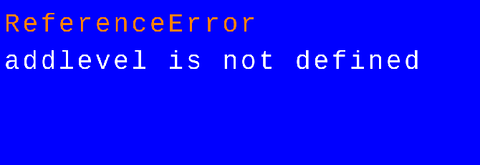

# Entry 3
##### 2/9/25 (happy new year!)

# Context/Where I am now

My goal from the last entry was to make a background/scene area to start off with. The idea was to have the player start in a room, then exit out to a greater space where they could explore. Now, I thought the hard part was going to make the second room. But, despite [(even this video's insight)](https://www.youtube.com/watch?v=jcoiEpzD3yc), I wasn't able to get the backgrounds up and going.

# My Background issues
## The goal
My goal was to try to make the starter room for the player to spawn into (as said before), this would be first a treehouse (smaller room/first room), then you could exit out into the larger area(bigger/second room). That as all, I wanted to also add dialogue for things (EXP: if the player wanted to go somewhere they were not supposed too.) but that was MVP, which I didn't even get to.

# How it went
## Attempt one: By Myself
[(Using the Kaboom Playground as a reference)](https://kaboomjs.com/play?example=rpg), I tried to write the code myself without copy and pasting anything. To get a feel for how it works. I got this:

In Kaboom, this is how the program builds its levels in a way. In this case, you use ``-`` to tell the code that "Hey! Something should be here!".

This is defining what each symbol should look like. You can see that I tried to tell the code that ``-`` should be a block, so in theroy, it should've come up with [this image](treehousewallsPlaceholder.png) acting as "walls". However, this just broke my code.

This was the error I got after this, I tried getting rid of the extra variables (Because thanks to slack, I realized it was defined twice.) But it seemed not enough. So later, I went and tried to rewrite my code right from the [(Playground)](https://kaboomjs.com/play?example=rpg) itself. Using the code it used
## Attempt two: With the playgrounds help.
After the first try, I went back and copied the code they had there. And then I edited it to how I saw fit, Here is what I had after I did everything.
[alt text](image.png)
This code didn't work either, but it was due to something I'm not sure how to fix. It claims that "Tile Width" is *not* defined. My first step to try and fix this was try to edit Width/Height. But that didn't do anything. Most videos I watched on Kaboom.js RPG's all had the same way of writing that line as how I wrote it. So I am not 100% sure what went wrong.
# The Goal for Blog 4
So, I really need to get the background done. But after I do that, my goal is to make/add dialogue. Like how I wanted to do for my MVP. It's to keep the player from wondering out of bounds, plus I could get whitty with what I could write. It would probably be fun. Another goal (not code related) is to start on actual background sprites. This is more of a MVP but, it's something I need to start doing.
# FP take-aways
## Coding-Related
Functions. There are a lot of Functions, Kaboom.js is like a Functions refresher. Which is honestly something I needed. As well as an Arrays refresher. You need to use Functions + Variables for the scenes/background creation.
## Non-Coding Related
Oddly, my failures in making a scene is fueling me to find out why. My take away is that if you want to get something done, do everything you can. When trying to find out how to make a scene, I asked friends, slack, and even youtube. Even though I am still working on it I use my failures as a drive to complete what I want too.

[Previous](entry02.md) | [Next](entry04.md)

[Home](../README.md)
